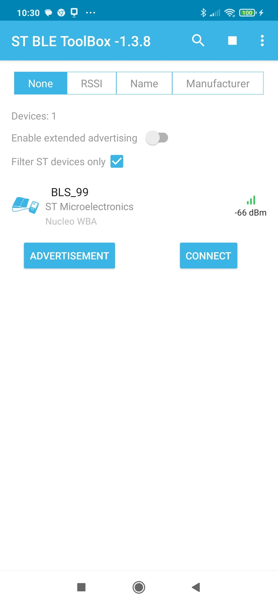

# STM32WBA-BLE-Blood-Pressure

* The STM32WBA-BLE-Blood-Pressure demonstrating Bluetooth® SIG [Blood Pressure Profile 1.0.1](https://www.bluetooth.org/DocMan/handlers/DownloadDoc.ashx?doc_id=457086&vId=496608) example, based on STM32CubeWBA v1.3.1
 
## Hardware Needed

  * This example runs on STM32WBAxx devices.
  * Connect the Nucleo Board to your PC with a USB cable type A to mini-B to ST-LINK connector (USB_STLINK). 

## User's Guide

1) Run this Bluetooth® Low Energy Blood Pressure project where the STM32WBA will advertise

2) Use the ANDROID/IOS ST BLE Sensor application or ST BLE Toolbox application to connect with this [Blood Pressure Profile 1.0.1](https://www.bluetooth.org/DocMan/handlers/DownloadDoc.ashx?doc_id=457086&vId=496608) (BLS_XX where XX is the 2 last digit of the Bluetooth® Device Address)
  
   Scan on ANDROID/IOS:
   

       
   

   After Connection and Selecting the [Blood Pressure Service](https://www.bluetooth.com/specifications/bls-1-1-1/) on ANDROID/IOS you will see the following Characteristics:
   

       
       
    

	
3) Use terminal programs like Tera Term to see the logs of each board via the onboard ST-Link. (115200/8/1/n)

   

       
   

## Troubleshooting

**Caution** : Issues and the pull-requests are **not supported** to submit problems or suggestions related to the software delivered in this repository. The STM32WBA-BLE-Blood-Pressure example is being delivered as-is, and not necessarily supported by ST.

**For any other question** related to the product, the hardware performance or characteristics, the tools, the environment, you can submit it to the **ST Community** on the STM32 MCUs related [page](https://community.st.com/s/topic/0TO0X000000BSqSWAW/stm32-mcus).